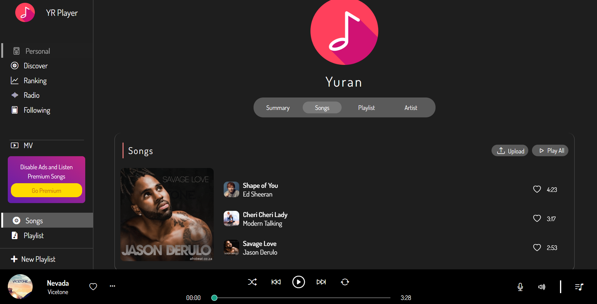
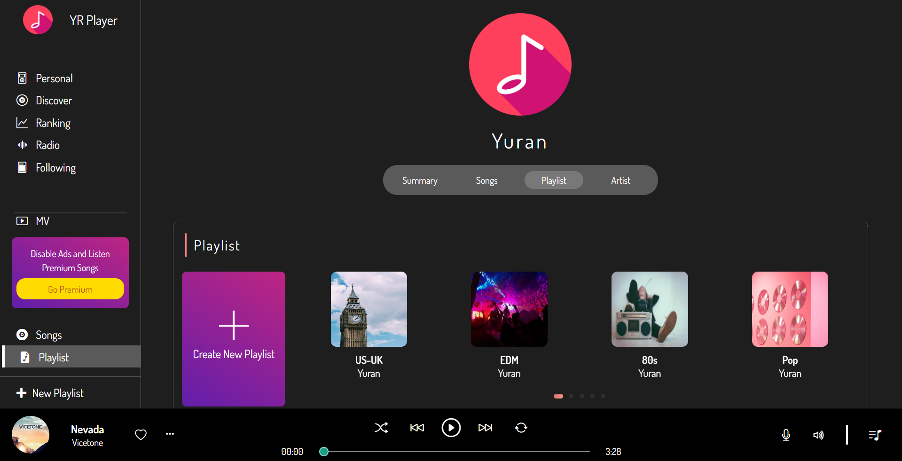
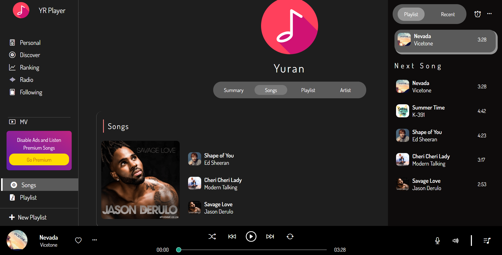

<h1 align="center">Music Player</h1>

<strong>A simple music player project</strong>

  
  

  
  
  
  
  

<a href="https://yuran1811.github.io/Music-Player/" target="_blank">Live Demo</a>

## Features

- [x]: Play/Pause a song
- [x]: Play Prev/Next song in a playlist
- [x]: Shuffle/Repeat a song
- [x]: Adjust volumn
- [x]: Recent played songs history
- [x]: Personal songs, playlists
- [x]: Ranking, Top100 (using [`nhaccuatui-api-full`](https://www.npmjs.com/package/nhaccuatui-api-full))

- **Upcoming**
  - Add favorite songs into a playlist
  - Add details for setting panel
  - Add error page, ...
  - Add Time-release
  - Create new playlist, ...
  - Show Song lyrics
  - Show artists' info, ...
  - Show info about the keyword from search bar
  - Render Ranking Graph (use Canvas)
  - Render Discover UI, Radio UI, Following UI, Playlists / Topics UI, ...
- **Todo**
  - Fix Responsive Bugs (mobile view)

## Screenshots

